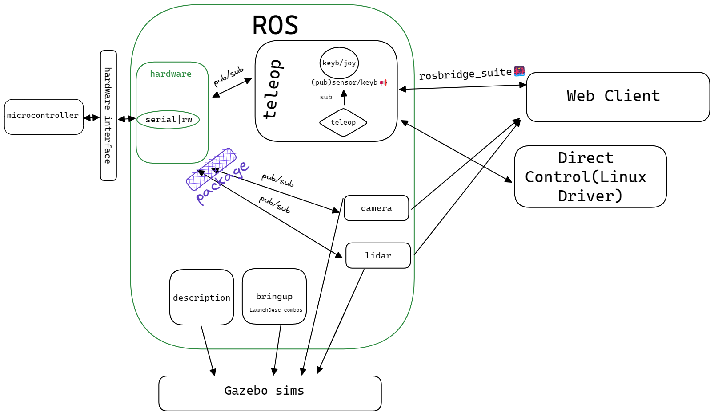

# robo-wheel-server

Stack:
- Ubuntu 22.04
- ROS2(humble)
- Gazebo(Fortress)

## How to start
1. Install ROS2 Humble desktop and ros-dev-tools
2. Clone this repo `git clone https://github.com/Ormared/robo-wheel-server -b ros2`
3. Enter folder and install dependencies 
```bash
cd /robo-wheel-server/ws
sudo apt install rosdep
rosdep init
rosdep install -i --from-path src --rosdistro humble -y
```
4. Build 
```
colcon build
```
5. Source and Bringup(from ws)
```
. install/setup.bash
ros2 launch bringup teleop_serial_launch.py
```
6.(optional) Start local keyboard controlls
```
ros2 run teleop_twist_keyboard teleop_twist_keyboard

```
## Core folders(inside `/src`):


- __hardware__ - serials and stuff. Either native(shouldn't be problematic as we already have basic code and aren't constrained by memory) or [transport_drivers/serial_drive](https://github.com/ros-drivers/transport_drivers)(includes UDP) or [micro-ros](https://micro.ros.org/docs/overview/features/)
- __teleop__ - teleoperation aka remote control(keyboard, joysticks, etc.). Do read about some `msg` like `sensor_msgs/Joy`[(joystick)](https://docs.ros.org/en/api/sensor_msgs/html/msg/Joy.html) and `geometry_msgs/Twist`[(vectors)](https://docs.ros.org/en/api/geometry_msgs/html/msg/Twist.html). Also [ros-teleop package](https://github.com/ros-teleop/teleop_twist_keyboard) which already has both.
- __bringup__ - bring up is a default name for a repository that has all the necessary stuff for initialization/start(starting sensors, communication staff)
- description - robot's "physical" description
	- urdf
	- rviz
	- supportive config files for urdf/rviz/robot itself like meshes or `.xacro`
- __gazebo__
- _(in the future)_ __navigation__
- _(questionable)_ [__controllers__](https://control.ros.org/humble/index.html)- framework for middleware between hardware and ros??? I am not sure what's this one about but I've seen it in one [repo](https://github.com/deborggraever/ros2-mecanum-bot). [Good explanation](https://articulatedrobotics.xyz/tutorials/mobile-robot/applications/ros2_control-concepts) but([other side](https://www.reddit.com/r/ROS/comments/161s6cv/to_ros2_control_or_to_not_ros2_control/)) I am not 100% sold. **Requires testing**
- __camera__(Realsense d435i)
- __lidar__(SLAMTEK s2)

Other packages can be added depending on the needs.
Overall, except for gazebo, we can just as well implement this project as monopackage but early modularity does help to fester 

The overhead of an extra ROS package is not very large. Define new separate packages wherever they make sense:
- If a group of nodes with similar dependencies are generally used together, consider combining them in a single package.
- When you anticipate that certain functionalities will be reused across different projects or applications, placing them in their own packages promotes code reuse.
-  If some nodes have common dependencies on shared code that you do not wish to export publicly, they can be combined internally within a single package.

>Choose package names carefully:
>- Node names are local within their package, but package names are global to the entire ROS ecosystem.
>- They are messy to change later.


## Packages:
You can find ros packages using:
https://index.ros.org/packages/


## References:
> be careful with examples and don't look at them too hard. Those examples were made in specific condition and for relatively specific conditions. Compared to them we don't have something like rPI or Arduino but a whole-ass motherboard. Remember those things when considering what code to write.
- simple mecanum bot https://github.com/deborggraever/ros2-mecanum-bot
- an amalgamation of packages without a spec of code https://github.com/linorobot/linorobot2/tree/humble
- monopackage with ROS1 bridge https://github.com/Tarekshohdy688/Mobile_Macnum_Robot/tree/main
- cool robot model with simplistic ROS1 code https://drive.google.com/drive/folders/1-0-g3gYnAx6E7f_bgpemk0AYRoVUophV
- website with some good tutorials(urdf, gazebo, sensors, etc.) and some cool tools like joytester https://articulatedrobotics.xyz/
- nodes vs packages https://answers.ros.org/question/9133/packages-vs-nodes/
- nodes https://docs.ros.org/en/humble/Tutorials/Beginner-CLI-Tools/Understanding-ROS2-Nodes/Understanding-ROS2-Nodes.html
- teleop
	- https://wiki.ros.org/universal_teleop
	- https://www.waveshare.com/wiki/RoArm-M2-S_ROS2_Serial_Communication_Node
	- Outdated but does have some good stuff https://articulatedrobotics.xyz/tutorials/mobile-robot/applications/adv-teleop/
- ros2 controllers
    - https://www.reddit.com/r/ROS/comments/161s6cv/to_ros2_control_or_to_not_ros2_control/
    - https://articulatedrobotics.xyz/tutorials/mobile-robot/applications/ros2_control-concepts/
- (IMPORTANT) controllers vs drivers(hardware interfaces) https://answers.ros.org/question/12182/controllers-vs-drivers/
- rosbridge 
    - https://foxglove.dev/blog/using-rosbridge-with-ros2
    - https://robotwebtools.github.io/
    - https://github.com/RobotWebTools/rosbridge_suite


